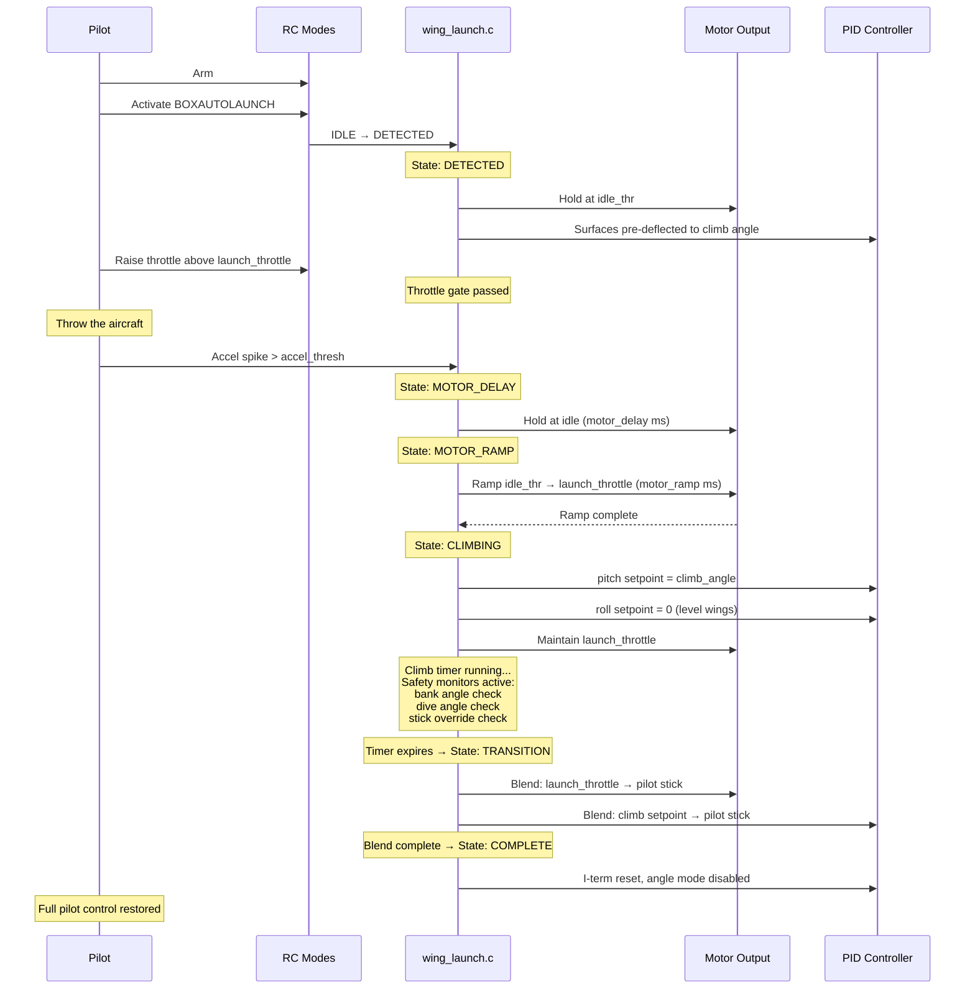
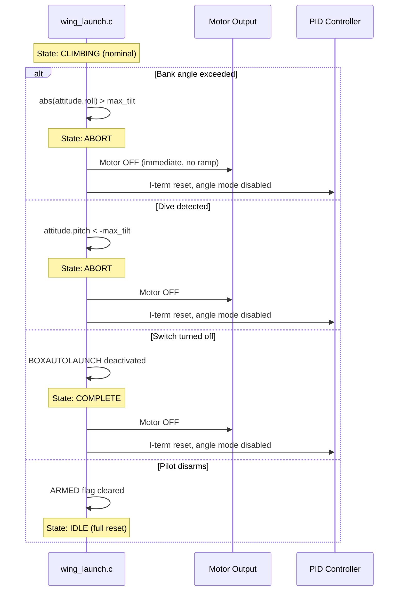

# PR Diagrams — Mermaid Source

Copy these into GitHub PR descriptions. GitHub renders Mermaid in ```mermaid code blocks.

---

## 1. Wing Autolaunch — State Machine

```mermaid
stateDiagram-v2
    [*] --> WING_LAUNCH_IDLE

    WING_LAUNCH_IDLE --> WING_LAUNCH_DETECTED : arm + BOXAUTOLAUNCH active

    state "WING_LAUNCH_DETECTED" as detected {
        note right of detected
            Motors held at idle_thr
            Surfaces pre-deflected to climb angle
            Waiting for throttle gate + accel spike
        end note
    }

    WING_LAUNCH_DETECTED --> WING_LAUNCH_MOTOR_DELAY : throttle gate passed\n+ accel > accel_thresh
    WING_LAUNCH_DETECTED --> WING_LAUNCH_ABORT : excessive tilt
    WING_LAUNCH_DETECTED --> WING_LAUNCH_IDLE : pilot disarms

    state "WING_LAUNCH_MOTOR_DELAY" as delay {
        note right of delay
            Servos snap to climb position
            Motor held at idle
            Brief delay (motor_delay ms)
        end note
    }

    WING_LAUNCH_MOTOR_DELAY --> WING_LAUNCH_MOTOR_RAMP : delay elapsed

    state "WING_LAUNCH_MOTOR_RAMP" as ramp {
        note right of ramp
            Motor ramps linearly from
            idle_thr to launch_throttle
            over motor_ramp ms
        end note
    }

    WING_LAUNCH_MOTOR_RAMP --> WING_LAUNCH_CLIMBING : ramp complete
    WING_LAUNCH_MOTOR_RAMP --> WING_LAUNCH_ABORT : excessive tilt
    WING_LAUNCH_MOTOR_RAMP --> WING_LAUNCH_TRANSITION : stick override

    state "WING_LAUNCH_CLIMBING" as climb {
        note right of climb
            Pitch targets climb_angle
            Roll levels wings (angle mode)
            Throttle at launch_throttle
        end note
    }

    WING_LAUNCH_CLIMBING --> WING_LAUNCH_TRANSITION : climb_time expires
    WING_LAUNCH_CLIMBING --> WING_LAUNCH_TRANSITION : stick override
    WING_LAUNCH_CLIMBING --> WING_LAUNCH_ABORT : bank > max_tilt\nOR pitch < -max_tilt

    state "WING_LAUNCH_TRANSITION" as trans {
        note right of trans
            Linear blend from launch
            setpoints to pilot stick
            over transition ms
        end note
    }

    WING_LAUNCH_TRANSITION --> WING_LAUNCH_COMPLETE : blend complete

    state "WING_LAUNCH_ABORT" as abort {
        note right of abort
            Motor OFF immediately
            PID I-term reset
            Angle mode disabled
            Returns control to pilot
        end note
    }

    WING_LAUNCH_ABORT --> WING_LAUNCH_COMPLETE : immediate
    WING_LAUNCH_COMPLETE --> WING_LAUNCH_IDLE : disarm
```

---

## 2. Wing Autolaunch — Sequence Diagram



---

## 3. Wing Autolaunch — Abort Sequence



---

## Usage Notes

### In the PR description

Wrap each diagram in a collapsible details block so it doesn't dominate the PR:

```markdown
<details>
<summary>State machine diagram</summary>

\```mermaid
stateDiagram-v2
    ...
\```

</details>

<details>
<summary>Sequence diagram — successful launch</summary>

\```mermaid
sequenceDiagram
    ...
\```

</details>
```

### CLI parameters — Wing Autolaunch

| Parameter | Default | Range | Description |
|-----------|---------|-------|-------------|
| `wing_launch_accel_thresh` | 25 (2.5G) | 10-100 | Accel magnitude to detect throw (0.1G units) |
| `wing_launch_motor_delay` | 100 | 0-500 | Delay before motor spool after throw detected (ms) |
| `wing_launch_motor_ramp` | 500 | 100-2000 | Motor ramp duration from idle to launch throttle (ms) |
| `wing_launch_throttle` | 75 | 25-100 | Motor output during climb phase (%) |
| `wing_launch_climb_time` | 3000 | 1000-10000 | Duration of powered climb (ms) |
| `wing_launch_climb_angle` | 45 | 10-60 | Target pitch angle during climb (degrees) |
| `wing_launch_transition` | 1000 | 200-3000 | Blend duration back to pilot control (ms) |
| `wing_launch_max_tilt` | 45 | 5-90 | Bank/dive angle abort threshold (degrees) |
| `wing_launch_idle_thr` | 0 | 0-25 | Motor output while waiting for throw (%) |
| `wing_launch_stick_override` | 0 | 0-100 | Stick deflection to exit climb early (%, 0=disabled) |
