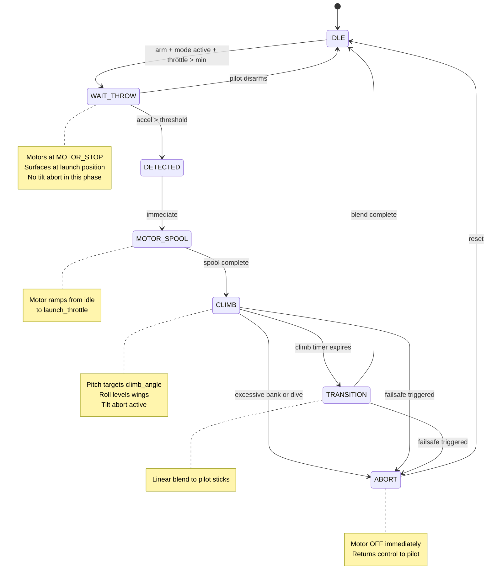
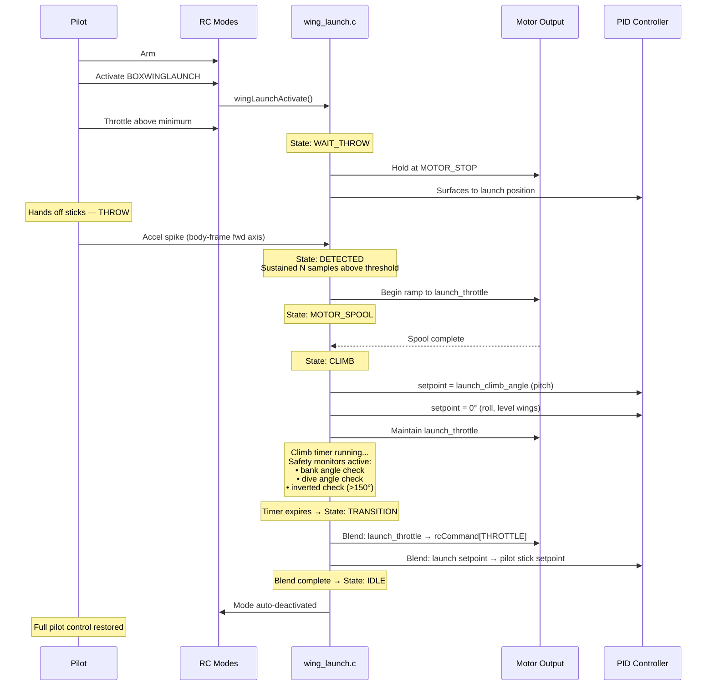
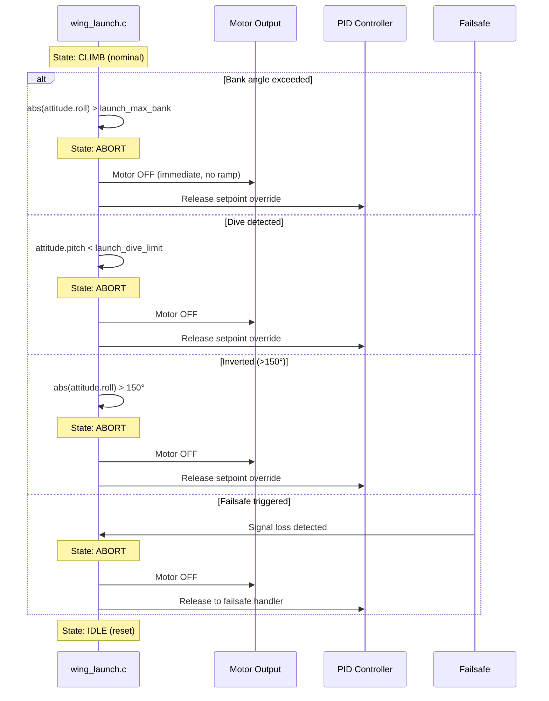

## Summary

Adds a hand-launch (throw launch) mode for fixed-wing `USE_WING` builds. When the pilot arms with the AUTOLAUNCH switch active and raises throttle, the aircraft waits for a throw (acceleration spike), then automatically spools motors, climbs at a fixed pitch angle, and smoothly blends control back to the pilot.

All code gated behind `#ifdef USE_WING_LAUNCH`. **Zero impact on multirotor builds.**

Key design decisions:
- **Throw detection only** — motors stay at idle until acceleration exceeds threshold, safe for hand launch
- **Throttle gate** — pilot must raise throttle above launch level before throw detection arms, preventing false triggers
- **Fixed pitch climb** — angle mode holds configurable climb angle with wings level
- **Smooth transition** — linear blend from launch setpoints to pilot stick commands over configurable duration
- **Immediate abort on safety violation** — excessive roll, dive, or inverted attitude cuts motors instantly

## How It Works

**Phase progression:** IDLE → DETECTED → MOTOR_DELAY → MOTOR_RAMP → CLIMBING → TRANSITION → COMPLETE

1. **Idle** — AUTOLAUNCH switch on, waiting for arm
2. **Detected** — Armed, throttle gate passed. Motors at idle. OSD shows "THROW!" — waiting for acceleration spike above threshold. No tilt abort in this phase (pilot may hold plane at any angle)
3. **Motor Delay** — Throw detected. Brief configurable delay before motor spool (default 100ms)
4. **Motor Ramp** — Linear throttle ramp from idle to launch throttle over configurable duration (default 500ms)
5. **Climbing** — Full launch throttle, pitch held at climb angle (default 45°), wings level. OSD shows countdown "CLM X.Xs". Safety monitors active
6. **Transition** — Smooth blend from launch setpoints to pilot stick commands over configurable duration (default 1000ms). Throttle and pitch angle gradually return to pilot control
7. **Complete** — Normal flight restored. Mode auto-deactivates

**Abort triggers** (MOTOR_RAMP / CLIMBING only → immediate motor cut):
- Roll angle exceeds `max_tilt` (default 45°)
- Dive angle exceeds `max_tilt`
- AUTOLAUNCH switch turned off mid-launch
- Disarm during launch
- Stick override threshold exceeded (if enabled)

> **Note:** Tilt abort is intentionally *not* active during the DETECTED (pre-throw) phase. Motors are at idle, and the pilot may hold the aircraft at any angle. This prevents a dropped or tilted plane from aborting into COMPLETE state where full pilot throttle would go straight to the motor.

State machine diagram

Sequence diagram — successful launch

Abort sequence diagram

## OSD

New `OSD_WING_LAUNCH_STATUS` element displays launch state with severity-based coloring:

| State | Display | Severity |
|-------|---------|----------|
| Idle (switch on) | `LNCH RDY` | Info |
| Throttle gate | `THR UP` | Warning |
| Waiting for throw | `THROW!` | Warning |
| Motor delay/ramp | `LNCH GO` | Warning |
| Climbing | `CLM X.Xs` | Warning (with countdown) |
| Transition | `RECOVER` | Info |
| Abort | `ABORT` | Critical |

Enable the **Wing Launch Status** element in the OSD tab of the configurator.

## CLI Parameters

All parameters set via `set <param> = <value>` in the CLI.

| Parameter | Default | Range | Description |
|-----------|---------|-------|-------------|
| `wing_launch_accel_thresh` | 25 | 10-100 | Throw detection threshold (units of 0.1G, so 25 = 2.5G) |
| `wing_launch_motor_delay` | 100 | 0-500 | Delay before motor ramp starts after throw (ms) |
| `wing_launch_motor_ramp` | 500 | 100-2000 | Duration of throttle ramp to launch power (ms) |
| `wing_launch_throttle` | 75 | 25-100 | Launch throttle percentage during climb |
| `wing_launch_climb_time` | 3000 | 1000-20000 | Duration of climb phase (ms) |
| `wing_launch_climb_angle` | 45 | 10-60 | Pitch angle during climb (degrees) |
| `wing_launch_transition` | 1000 | 200-3000 | Blend duration back to pilot control (ms) |
| `wing_launch_max_tilt` | 45 | 5-90 | Max roll/dive angle before abort (degrees) |
| `wing_launch_idle_thr` | 0 | 0-25 | Idle throttle while waiting for throw (%) |
| `wing_launch_stick_override` | 0 | 0-100 | Stick deflection % to force transition (0 = disabled) |

## Blackbox Debug

Set `debug_mode = WING_LAUNCH` to log launch internals:

| Channel | Field | Units | Notes |
|---------|-------|-------|-------|
| `debug[0]` | Launch state | 0-7 | State machine phase |
| `debug[1]` | State elapsed | ms | Time in current state |
| `debug[2]` | Motor output | 0-1000 | Motor command x 1000 |
| `debug[3]` | Accel magnitude | 0-N | Acceleration x 100 (G units) |
| `debug[4]` | Pitch angle | degrees | Current pitch attitude |
| `debug[5]` | Roll angle | degrees | Current roll attitude |
| `debug[6]` | Transition factor | 0-1000 | Blend progress x 1000 |
| `debug[7]` | Climb remaining | ms | Countdown during climb (0 otherwise) |

## Files Changed

**Core flight logic:**
- `src/main/flight/wing_launch.c` — State machine, throw detection, motor control, transition blend (+307 lines)
- `src/main/flight/wing_launch.h` — State enum, public API

**PID / Servo / Mixer integration:**
- `src/main/flight/pid.c` — Pitch/roll setpoint override during climb
- `src/main/flight/pid.h` — Wing launch function declarations
- `src/main/flight/pid_init.c` — Launch state initialization
- `src/main/flight/servos.c` — Elevon pre-deflection when switch is on (pre-launch pitch-up)
- `src/main/flight/mixer.c` — Throttle blending during transition

**Config / CLI:**
- `src/main/cli/settings.c` — 10 CLI parameter entries
- `src/main/fc/parameter_names.h` — Parameter name strings

**Mode / Core:**
- `src/main/fc/core.c` — BOXWINGLAUNCH mode handling
- `src/main/fc/rc_modes.h` — BOXWINGLAUNCH mode ID
- `src/main/msp/msp_box.c` — Mode visibility for wing builds

**OSD:**
- `src/main/osd/osd.h` — OSD element enums
- `src/main/osd/osd.c` — Element registration
- `src/main/osd/osd_elements.c` — Launch status rendering with countdown

**Debug / Blackbox:**
- `src/main/build/debug.h` — `DEBUG_WING_LAUNCH` enum entry
- `src/main/build/debug.c` — Debug mode string
- `src/main/blackbox/blackbox.c` — Launch parameter logging

**Build:**
- `src/main/target/common_pre.h` — `USE_WING_LAUNCH` feature flag
- `mk/source.mk` — wing_launch.c added to build

**Documentation:**
- `BF_AUTOLAUNCH_ROADMAP.md` — Feature roadmap
- `PR_DIAGRAMS.md` — Mermaid diagrams for PR
- `WING_LAUNCH_TESTING.md` — Testing guide

**Tests:**
- `src/test/unit/wing_launch_unittest.cc` — Unit tests (+386 lines)
- `src/test/Makefile` — Test build target

## Test Plan

- [ ] Builds clean for USE_WING targets (SPEEDYBEEF405WING, MICOAIR743)
- [ ] Unit tests pass (`make test`)
- [ ] No effect on multirotor builds (verified with non-wing target)
- [ ] Flight tested: throw detection triggers correctly
- [ ] Flight tested: full launch sequence (throw → climb → transition → normal flight)
- [ ] Abort triggers on excessive bank angle
- [ ] OSD shows correct phase with climb countdown
- [ ] Blackbox debug channels log correctly
- [ ] Elevon pre-deflection works when switch is on before arm
- [ ] Throttle gate prevents false trigger when throttle is low
